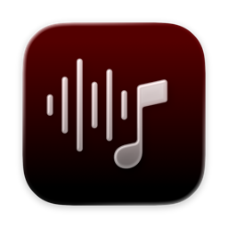

<p align="center">
  
</p>

<h1 align="center">Spotiglass</h1>

<p align="center">
  Native macOS Spotify client with OAuth PKCE, the Spotify Web API, and Web Playback SDK playback in a glass-style SwiftUI shell.
</p>

<p align="center">
  <a href="docs/getting-started.md">Get started</a>
  ·
  <a href="docs/building-and-testing.md">Build and test</a>
  ·
  <a href="docs/ci-and-releases.md">Release artifact</a>
  ·
  <a href="docs/README.md">Documentation</a>
</p>

## What you get

- Signed-in playlist and track browsing with sidebar pins, queue, artist pages, and command palette search.
- In-app playback through the Spotify Web Playback SDK in a hidden `WKWebView`.
- Appearance controls for System, Light, or Dark, plus command palette backdrop blur.
- Keychain-backed refresh tokens, local playlist cache, and keyboard shortcuts you can remap in Settings.

## Requirements

- macOS **26** or newer with Xcode that matches the project deployment target.
- A [Spotify Developer](https://developer.spotify.com/dashboard) app client ID (PKCE public client; no client secret).
- **Spotify Premium** for Web Playback SDK streaming.

See [Limitations](docs/limitations.md) for unsigned local builds, Gatekeeper, and operational constraints.

## Quick start

1. Create a Spotify app in the [Spotify Developer Dashboard](https://developer.spotify.com/dashboard).
2. Enable Web Playback SDK and set redirect URI to `http://127.0.0.1:43824/callback`.
3. Open `Spotiglass.xcodeproj` and run the **Spotiglass** scheme.
4. Paste the client ID, connect Spotify, then browse playlists and play tracks.

Setup details, OAuth scopes, and manual playback checks: [Getting started](docs/getting-started.md).

## Build, test, and run

From the repository root:

```sh
make build
make test
make run
```

Unsigned Release bundle (same layout as CI):

```sh
make release
```

Output: `build/DerivedData/Build/Products/Release/Spotiglass.app`.

For raw `xcodebuild` commands, test-host Keychain behavior, and icon pipeline notes, see [Building and testing](docs/building-and-testing.md).

## Release artifact

The GitHub Actions workflow **Release artifact** runs unit tests, builds an unsigned Release `Spotiglass.app`, and uploads it for 14 days. Download and first-launch steps: [CI and releases](docs/ci-and-releases.md).

## Documentation

| Guide | Description |
|-------|-------------|
| [Getting started](docs/getting-started.md) | Spotify dashboard setup, OAuth scopes, first run |
| [Building and testing](docs/building-and-testing.md) | `make`, `xcodebuild`, local Release bundle |
| [CI and releases](docs/ci-and-releases.md) | Workflow dispatch artifact, Gatekeeper |
| [Data storage](docs/data-storage.md) | Keychain, cache paths, `settings.json` |
| [Pinning](docs/pinning.md) | Sidebar pins and drag targets |
| [Limitations](docs/limitations.md) | Premium, signing, API limits |

## Regenerate README logo

The README logo is exported from the app icon pipeline:

```sh
scripts/generate_readme_logo.sh
```

Use `scripts/generate_readme_logo.sh --rebuild` to force a fresh unsigned Release build first.

## Support

If Spotiglass has been useful and you want to support ongoing development:

- [Buy Me a Coffee](https://buymeacoffee.com/isaaclins) — tips fund releases and docs; see [SUPPORT.md](SUPPORT.md) for details.

## Contributing

Open an issue describing the change you want to make before opening a pull request so scope and direction stay aligned.

## License

See [LICENSE](LICENSE). Personal, non-commercial use is permitted under the repository license; commercial or organizational use requires a separate written license from the copyright holder.
