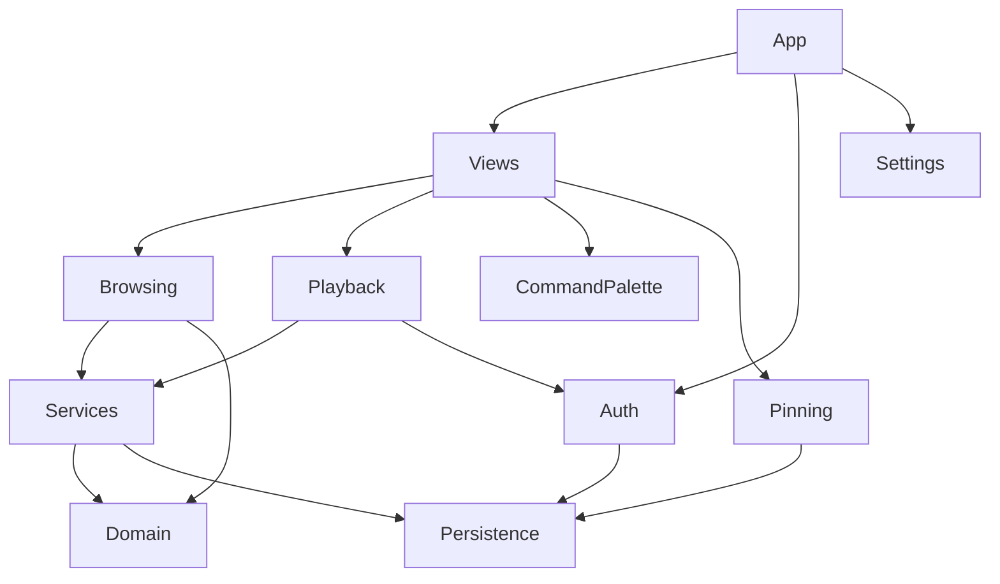

# Architecture

Spotiglass is a native macOS SwiftUI app: OAuth PKCE sign-in, Spotify Web API for
library data, and Web Playback SDK audio through a hidden `WKWebView`.

## Module map

| Folder | Responsibility |
|--------|----------------|
| [`Spotiglass/App/`](../Spotiglass/App/) | `@main`, environment objects, Settings scene, test vs production Keychain |
| [`Spotiglass/Auth/`](../Spotiglass/Auth/) | PKCE, loopback OAuth, token refresh, `AuthViewModel` |
| [`Spotiglass/Services/`](../Spotiglass/Services/) | `SpotifyAPIClient`, DTO decoding, GET cache, LRC lyrics client |
| [`Spotiglass/Domain/`](../Spotiglass/Domain/) | App-facing models (`SpotifyTrack`, playlists) decoupled from wire DTOs |
| [`Spotiglass/Browsing/`](../Spotiglass/Browsing/) | Browsing protocols, row view models, load state, sidebar library types |
| [`Spotiglass/Views/`](../Spotiglass/Views/) | SwiftUI shell: playlist browser UI, immersive lyrics, queue, chrome |
| [`Spotiglass/Playback/`](../Spotiglass/Playback/) | Web Playback host, session VM, queue VM, transport controls |
| [`Spotiglass/CommandPalette/`](../Spotiglass/CommandPalette/) | ⌘K search, keymaps, command catalog |
| [`Spotiglass/Pinning/`](../Spotiglass/Pinning/) | Sidebar pins, drag-and-drop transfer types |
| [`Spotiglass/Persistence/`](../Spotiglass/Persistence/) | Keychain refresh tokens, playlist disk cache, lyrics cache |
| [`Spotiglass/Settings/`](../Spotiglass/Settings/) | `settings.json`, appearance, playback prefs, account UI |
| [`Spotiglass/Utilities/`](../Spotiglass/Utilities/) | Cross-cutting helpers (artwork cache, rate-limit display, width policy) |
| [`Spotiglass/Infrastructure/`](../Spotiglass/Infrastructure/) | Shared logging (`SpotiglassLog`) |

## Dependency direction

- **Views** depend on view models and services; they do not decode JSON directly.
- **Services** map Spotify DTOs → **Domain** models via `domainModel()`.
- **Auth** owns tokens; **Playback** requests playback-scoped access tokens through a bridge.

## Data and secrets

| Data | Location | Doc |
|------|----------|-----|
| Refresh token | Keychain (`com.isaaclins.spotiglass.spotify-auth`) | [data-storage.md](data-storage.md) |
| Settings | Application Support `settings.json` | [data-storage.md](data-storage.md) |
| Playlist cache | On-disk under app cache | [data-storage.md](data-storage.md) |
| OAuth callback | `127.0.0.1:43824` during sign-in | [getting-started.md](getting-started.md) |

## Playback pipeline

1. The app-scoped `SpotiglassPlaybackHost` retains one `WKWebView`; `SpotiglassPlaybackHostView` mounts it into a live scene and it loads bundled `SpotifyPlaybackHost.html`.
2. JavaScript SDK posts events to Swift (`SpotifyPlaybackBridge`).
3. `PlaybackSessionViewModel` coordinates device transfer, transport polls, and UI state.
4. `SpotifyPlaybackAPI` calls REST endpoints for queue, devices, and transport when needed.

## Browsing layout (current)

Refactor in progress:

- Protocols, row VMs, `PlaylistBrowserViewModel` (+ concerns), and playlist-browser helpers: `Spotiglass/Browsing/`
- Browser UI: `Spotiglass/Views/PlaylistBrowser/`

## Localization

- String Catalog: `Spotiglass/Localizable.xcstrings`
- Settings strings migrated first; remaining views follow in later passes.

## Logging

`SpotiglassLog` (`os.Logger` categories) is used in App, Pinning, Settings, Persistence,
and Domain. Auth, Services, Playback session, and Views adopt logging incrementally.

## Tests

Unit tests live in `SpotiglassTests/` with protocol mocks and ViewInspector for views.
The test host uses an in-memory refresh-token store when `XCTestConfigurationFilePath` is set.
